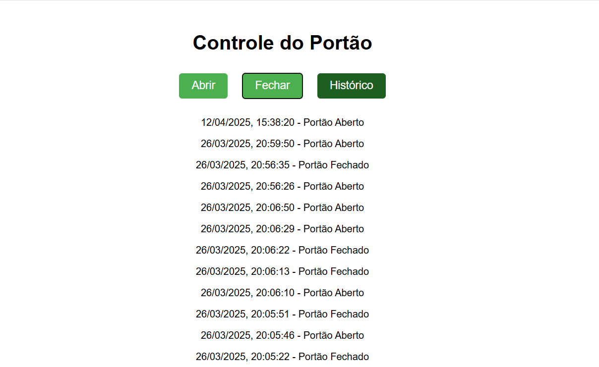

# 🚪 Sistema de Controle de Estado - Portão Residencial

Este projeto simula a **abertura e fechamento de um portão residencial**, implementando um sistema simples de **controle de estado**. Utiliza **Node.js** para o backend, **MongoDB com coleções temporais** para armazenar os eventos de abertura/fechamento, e foi desenvolvido no **Visual Studio Code**.

## 🖼️ Interface do Sistema

A interface apresenta botões para controlar o estado do portão (Abrir, Fechar) e consultar o histórico de ações:



---

## 🛠 Tecnologias Utilizadas

- **Node.js** – Runtime JavaScript para o desenvolvimento do backend.
- **Express.js** – Framework leve para criar a API REST.
- **MongoDB** – Banco de dados NoSQL utilizado com **coleções de séries temporais** para registrar os eventos de estado do portão.
- **MongoDB Compass** – Interface gráfica opcional para monitoramento do banco de dados.
- **HTML + CSS** – Interface simples e funcional para interação com o usuário.
- **Visual Studio Code** – Editor de código-fonte utilizado no desenvolvimento.

---

## 🔧 Funcionalidades

- 🔄 **Alternar o estado do portão**: Aberto ou Fechado.
- 🕒 **Registro automático com data e hora** de cada mudança de estado.
- 📦 **Armazenamento em coleção temporal** do MongoDB.
- 🧾 **Histórico completo** de alterações com exibição em tela.
- 📡 **API REST** para integração e testes com ferramentas externas.

---

## 🚀 Como Executar o Projeto

1. Clone o repositório:
   ```bash
   git clone https://github.com/seu-usuario/nome-do-repo.git
   cd nome-do-repo

2. Instale as dependências:
   ```bash
    npm install

3. onfigure a string de conexão com o MongoDB em um arquivo .env.

4. Inicie o servidor:
   ```bash
    node index.html
